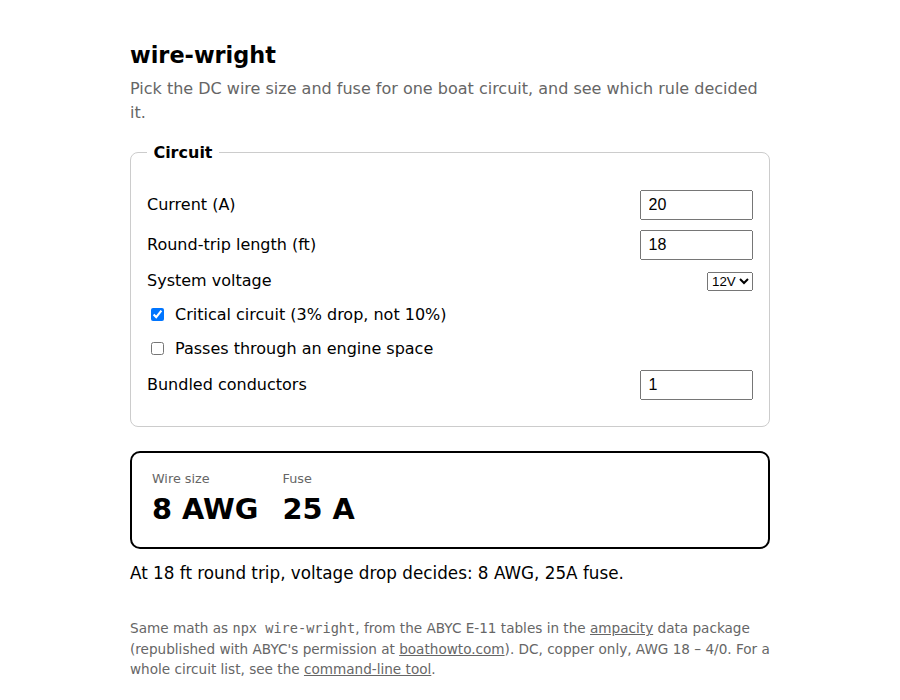

# wire-wright

[](https://mark-brannan.github.io/wire-wright/)

**[Try it in your browser](https://mark-brannan.github.io/wire-wright/)** —
type in a circuit, watch the wire size and fuse update as you drag the
length, and see which rule decided. It runs the same code as the CLI below
(`web/app.js` bundles `lib/calc.js` with esbuild; nothing is retyped —
`test/web-bundle.test.mjs` proves the two agree).

ABYC E-11 wire gauge, ampacity, and fuse sizing for small-craft DC
circuits. Reads a CSV circuit list, prints a sizing table, and flags
circuits whose inputs are still guesses.

```
npx wire-wright circuits.csv
```

## Method

For each circuit, the conductor is the **larger** of:

1. **Voltage-drop minimum** — circular mils = 10.75 × amps × round-trip
   feet ÷ allowable drop volts, at 3% (critical circuits) or 10%
   (non-critical).
2. **Ampacity minimum** — smallest conductor whose allowable amperage,
   derated for engine spaces and bundling, carries the load
   (ABYC E-11 Table 6A).

The fuse/breaker is the smallest standard rating at or above 125% of a
continuous load (100% if flagged non-continuous), and never above the
derated ampacity of the chosen conductor — the conductor is upsized if no
standard rating fits that window.

## Data provenance

Ampacity values, engine-space correction factors, and bundling derates are
transcribed from ABYC E-11 Table 6A as republished with ABYC's permission
at <https://boathowto.com/wiresize/wiresize_tables_abyc.pdf>. The
voltage-drop formula (K = 10.75, copper DC) is the standard E-11 method;
this implementation's output is test-verified against the ABYC 3% and 10%
conductor-size lookup tables from the same document (`npm test`).

## CSV columns

| column | required | meaning |
|---|---|---|
| `name` | yes | circuit label |
| `amps` | yes | continuous current, A |
| `length_ft` | yes | conductor length source → device → source (round trip), ft |
| `drop_pct` | no | 3 (default, critical) or 10 |
| `voltage` | no | system voltage, default 12 |
| `engine_space` | no | true/false, default false |
| `bundle` | no | conductors bundled together, default 1 |
| `insulation_c` | no | insulation rating °C, default 105 |
| `continuous` | no | default true; false uses 100% fuse target |
| `amps_source`, `length_source` | no | `guess` / `spec` / `measured` — anything not `measured` is flagged in output |
| `status` | no | e.g. `planned` / `installed` — non-installed flagged |
| `notes` | no | free text, passed through |

## Limits

- DC only, copper conductors, AWG 18 through 4/0.
- Sizing is per-circuit; it does not sum loads, check panel totals, or
  verify fuse interrupt ratings (AIC) — lithium banks need the fuse type
  their battery manufacturer specifies (typically Class T).
- Output is informational. Physical installation is governed by ABYC E-11
  itself and whoever surveys your boat.

## License

MIT.
